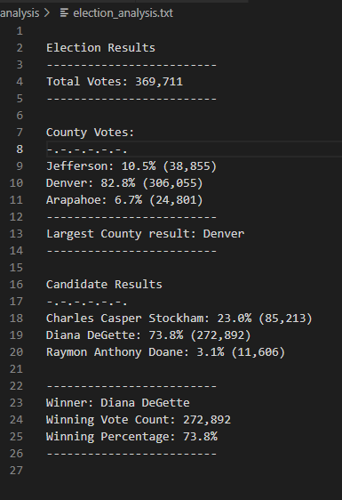

# Election_Analysis

## Project Overview
The following analysis was performed to obtain voting counts and information regarding an election process of Colorado Board. The employee requested to complete an election audit of a recent local congressional election. 

-Goals and product after the audit using python:

Calculate the total number of votes cast
Obtain a complete list of candidates who received votes
Calculate total number of votes each candidate received
Calculate percentage of votes each candidate won
Obtain the winner of the election based on popular vote
Calculate voter turnout for each county
Calculate percentage of votes from each county out of the total count
Obtain county with the highest turnout

## Resources
- CSV file and main data source: Resources\election_results.csv encoding UTF-8 [electionCSV](Resources\election_results.csv)
- Software used: Python 3.9.7(base, conda), Visual Studio Code 1.66.2 

## Election-Audit Results
- A total of 369711 votes were cast for the elections.

### County
-There where 3 County Votes: 
County 1: Jefferson that emitted a total of 38,855 votes
County 2: Denver that emitted a total of 306,055 votes
County 3: Araphahoe that emitted a total of 24,801 votes

The percentage of the total votes per county was
Jefferson: 10.5%
Denver: 82.8%
Arapahoe: 6.7%

- The largest number of votes per county was Denver

### Candidates
- There were 3 candidates in the election: 
    Candidate 1 was: Charles Casper Stockham
    Candidate 2 was: Diana DeGette
    Candidate 3 was: Raymon Anthony Doane

-Results based on the analysis showed that:
    Candidate Charles Casper Stockham, recieved 23.0% of the vote with a total of 85,213 votes. 
    Candidate Diana DeGette, recieved 73.8% of the vote with a total of 272,892 votes.
    Candidate Raymon Anthony Doane, recieved 3.1% of the vote with a total of 11,606 votes. 

- The winner of the election was Candidate Diana DeGette;
Winning Vote Count was 272,892, and the winning percentage 73.8%. 

## Summary:Election-Audit Summary
The following script can be used for any election. It is designed so that it reads data in the CVS file provided by the voting process.
As it is, it wouldn’t matter if more counties or candidates were to be listed or modified. 

One option would be to respect the first row label and order listing candidates and counties. In this matter this script would run despite changing the data within the csv file. If the election would be scaled up for instance for states only smaller changes like state instead of counties would be needed. 

A second option would be if the CSV file data order was different, then some minor adjustments like the row assignation would be needed in order to easily use this script for further election events. Assigning the appropriate coordinates for the variables would be needed but the main working instructions are already there.

The main steps to obtain counties or regions were votes come from as well as any amount of candidates percentage, final count of votes and winner is achieved with this script for other events.
However, if needed, some other modifications like further analysis regarding for example, regions per vote per candidate could also be achieved and offered if interested for further projects together. 

## Challenge Overview
This challenge was indeed a challenge in which was the first time trying to program a set of instructions in python, to perform basic data analysis. However it was very enriching process because the iterations and orders logic repeated just changing variables names and assignation 
 
## Challenge Summary
In the following challenge, a script was created to perform an election audit analysis to count votes, list counties and candidates as well as determining the winner of the election and print the information not only in a terminal but also a txt file for the client.

